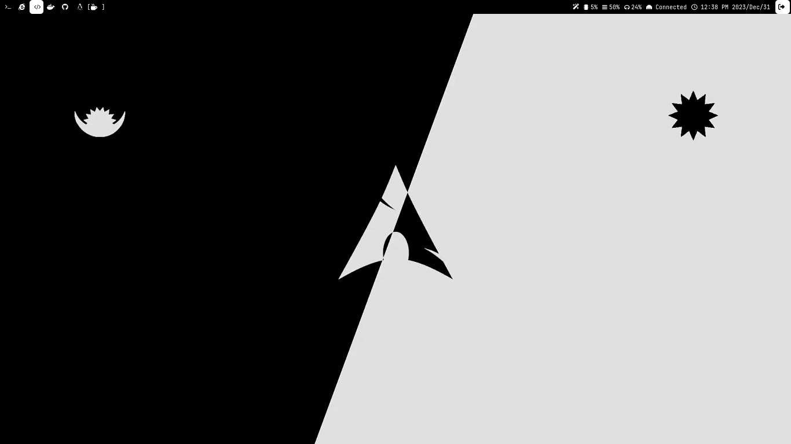
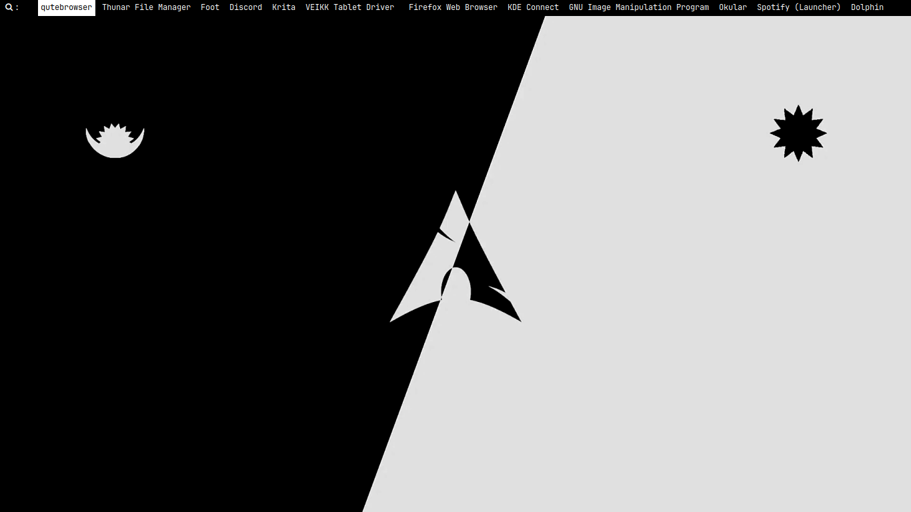

## MY Sway Configs

---
***What i use***
- Sway : Window Manager
- Waybar : status bar
- swww : for wallpaper 
- tofi : for the menu 
- JetBrains Mono Nerd font : for the glyphs
- alacritty : Terminal 
- Pywal : for generating colorscheme based on wallpaper (wal cmd comes from this)

---
 
 
